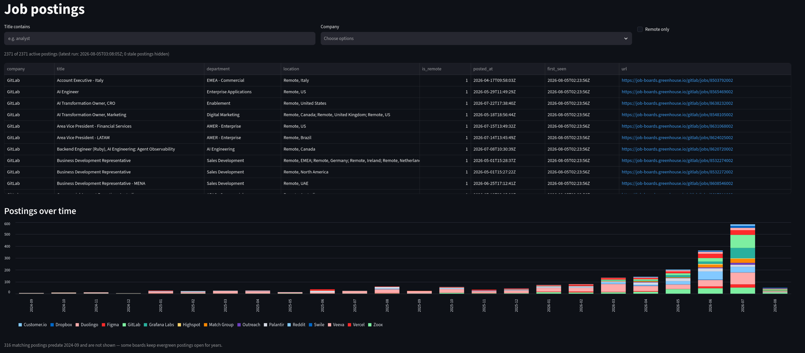

# Job Market Pipeline

A small local pipeline that pulls live job postings from public job-board
APIs (Greenhouse and Lever, no auth or scraping), stores them in SQLite,
and serves them to a Streamlit dashboard, SQL queries, and CSV exports for
Tableau. Everything runs locally and free — no cloud, no scheduler, no keys.



## Architecture

```
companies.json          which boards to pull (name, slug, source)
      |
pull_jobs.py            fetch both APIs -> normalize -> upsert into SQLite
      |
   jobs.db              raw_jobs (full JSON)  +  jobs (clean table)
      |
      +-- queries.sql            starter analysis queries
      +-- app.py                 Streamlit dashboard (filters + trend chart)
      +-- export_for_tableau.py  CSVs in exports/ for BI tools
```

- **`raw_jobs`** keeps the complete API response per posting, so the clean
  table can be rebuilt or extended later without re-fetching.
- **`jobs`** is the analysis table: title, department, location, remote
  flag, posted/updated dates, plus `first_seen` / `last_seen` run
  timestamps. All timestamps are ISO-8601 UTC strings.
- The two sources are normalized into the same columns: Greenhouse has no
  remote flag, so remote is inferred from the location text; Lever has an
  explicit `workplaceType`. Details are commented in `pull_jobs.py`.

## How to run

```sh
source .venv/bin/activate.fish   # or activate for bash/zsh
python pull_jobs.py              # pull all boards, upsert into jobs.db
streamlit run app.py             # dashboard at http://localhost:8501
python export_for_tableau.py     # write exports/*.csv
```

`pull_jobs.py` prints a per-company summary (fetched / new / updated /
skipped) and lists any slugs that 404'd. It is safe to re-run daily —
manually or from cron. `jobs.db` opens directly in DB Browser for SQLite;
`queries.sql` has starter queries.

To track another company, add one line to `companies.json` — no code
changes needed. Both APIs are public:

- `https://boards-api.greenhouse.io/v1/boards/{slug}/jobs?content=true`
- `https://api.lever.co/v0/postings/{slug}?mode=json`

## Why the upsert key is (source, source_job_id)

Greenhouse and Lever assign posting IDs independently, so the same numeric
ID can exist on both platforms for two unrelated jobs. Including `source`
in the primary key keeps the two namespaces separate.

That key also makes daily re-runs idempotent: each run upserts on
`(source, source_job_id)` — new postings are inserted with `first_seen` =
the run timestamp, existing postings get their mutable fields and
`last_seen` updated while `first_seen` is preserved. A posting whose
`last_seen` is older than the latest run has disappeared from its board —
that is the staleness signal (no rows are ever deleted, so history keeps
accumulating).
